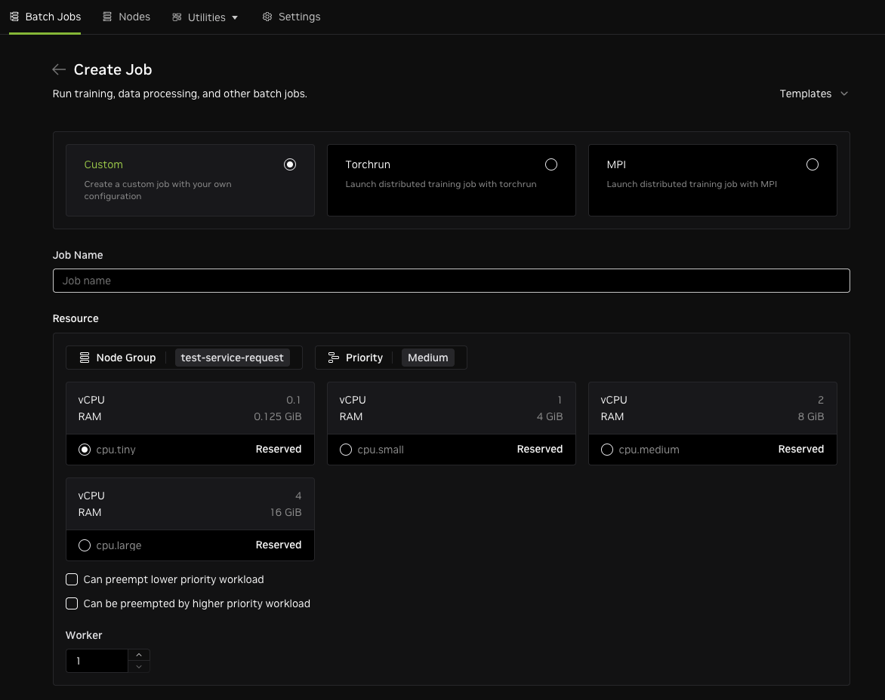

# Sample Batch Job Templates for PyTorch and MPI

DGX Cloud Lepton provides the ability to use pre-generated run commands for batch jobs which employ two common
distributed job launch frameworks frequently used in LLM training, fine-tuning, and data preparation:

* Distributed PyTorch and its launch tool `torchrun`
* MPI and its launch tool `mpirun`

The pre-generated examples are essentially "Hello World" examples for each. The examples provided here expand 
on those basics and ensure that a user can see how multi-node NCCL communications could be set up for PyTorch and MPI.

The template fragments here are intendeed to replace the boilerplate code that is pre-generated in the UI.
So you would copy and paste the contents of each respectively after the line:

`########## end auto generated by lepton ##########`

>[!NOTE]
>The minimum recommended GPU count for these examples is 8 GPU per node.

## Distributed PyTorch

This [template fragment](./torch-launch.sh) downloads a PyTorch program that executes an all-reduce bandwidth test across multiple GPU and nodes.
It also does a pip installation of various packages like DeepSpeed to the environment.
Recommended image for this template is the official NGC PyTorch image `nvcr.io/nvidia/pytorch:25.08-py3` or later. 

## MPI

This [template fragment](./nccl-mpi-template.sh) uses `mpirun` to execute `all_reduce_perf_mpi` across multiple GPU and nodes.
Recommended image for this template is the official NGC NeMo image `nvcr.io/nvidia/nemo:25.07` or later. This image
provides the [NCCL tests](https://github.com/NVIDIA/nccl-tests) as pre-built executables.

>[!NOTE]
>Both these examples rely on reasonable NCCL defaults and proper Infiniband setup for execution. Other CSP
>environments such as AWS EFA and GCP TCPXO will likely require more specific configuration. 
